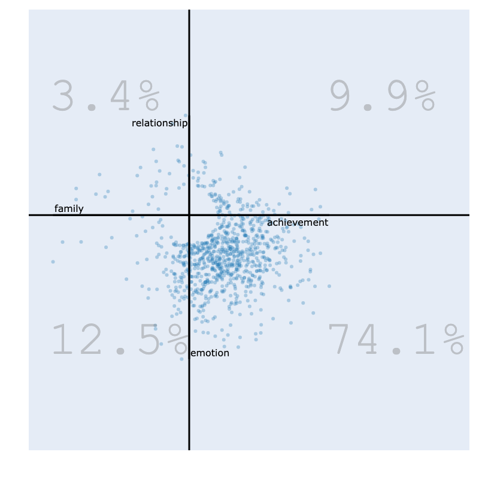

# 项目简介

**项目名称：** 青少年焦虑表达性写作的性别差异研究——主题变异与干预效果探索  
**研究者：** Annika Gao :contentReference[oaicite:0]{index=0}&#8203;:contentReference[oaicite:1]{index=1}  
**所属机构：** 帝国理工学院设计工程研究 MRes 项目  

## 一、研究背景  
青春期（12–16 岁）是情绪与认知快速发展的关键阶段，焦虑障碍在此时期高发（Solmi et al., 2022）。表达性写作（Expressive Writing, EW）作为一种低成本的情绪调节干预，在成人中已被证明可缓解压力、改善情绪（Pennebaker, 1997），但在青少年个体中效果尚存争议，且不同性别的干预反应可能存在显著差异。

## 二、研究目的  
1. **主题选择与情感表达**  
   - 探讨男女青少年在写作内容主题与情感倾向（客观/主观）上的差异。  
2. **焦虑水平变化**  
   - 比较干预前后两性参与者的焦虑评分（GAD‑7）变化。  
3. **主题—效果关联**  
   - 分析主题选择是否能解释性别在焦虑变化上的差异。
 - 

## 三、研究方法  
- **样本构建：**  
  - 20 名合成青少年参与者（10 ♀、10 ♂），共撰写 100 篇日记条目，模拟真实情境并保证隐私。  
- **干预流程：**  
  1. 基线测评：使用 GAD‑7 量表评估焦虑水平。  
  2. 一周写作：按周一、三、五、日及下周二五次写作，每次记录情境与情绪体验。  
  3. 追踪测评：一周后再次测量 GAD‑7，比较前后差异。  
- **数据分析：**  
  - **定性**：主题模型（Bunka LDA）提取潜在写作主题。 
  -  
  - **量化**：主观/客观情感评分对比、配对样本 t 检验检验干预效果。

## 四、主要发现  
- **主题差异**：  
  - **女性**偏向“人际关系”“情绪混乱”“生活挑战”；  
  - **男性**偏向“学业应对”“个人成长”“创意表达”。  
- **焦虑变化**：  
  - 合成样本中未观察到显著减轻，反而大多数参与者焦虑水平上升，“不改善”及“恶化”类别占优。  
  - 性别间焦虑增减差异不显著（配对 t 检验，p > .05）。  
- **真实数据对比**：  
  - 与 Alves & Jacques（2024）一个月后数据相比，本研究即时测量或导致短期“逆效应”。

## 五、结论与展望  
本研究揭示表达性写作在青少年群体中的即时干预效果有限，且不同性别在主题选择上存在显著差异。未来宜结合情绪调节训练（如认知重评）或延长随访期，以期增强写作干预的情绪缓解作用，并在真实人群中验证发现的普适性与持续性。
